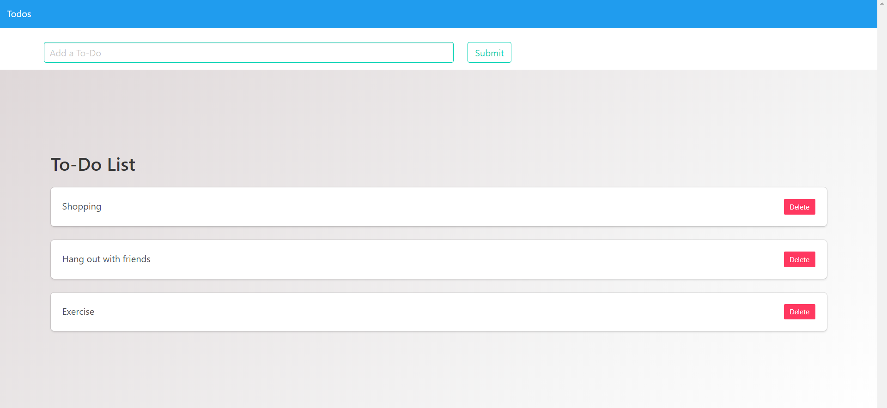

# Shopping-List

This is a very simple To-Do list that allows users to create To-Do items. Users can delete the items when clicking the delete button. This was created with HTML, Bulma.css for the CSS framework, Jquery, and Firebase's database to handle realtime modifications. That way users won't have to reinput their to-dos everytime they open the app.
